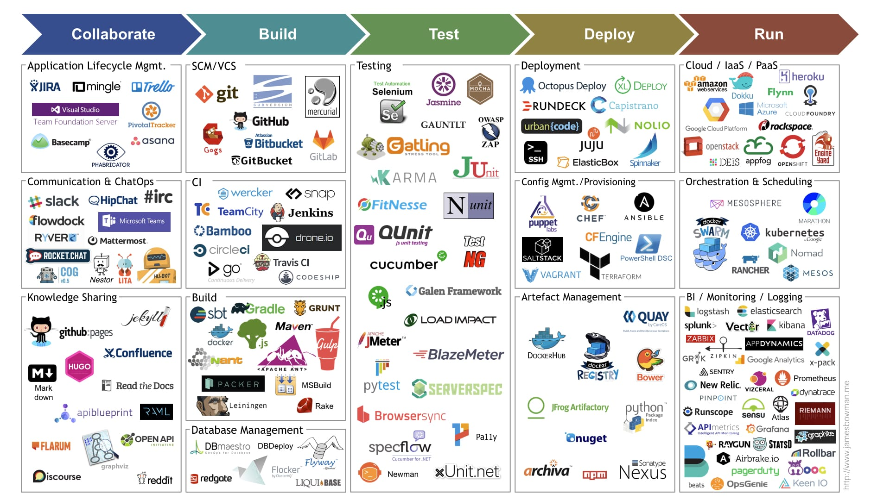

# CI/CD Tools for DevOps

**Application Life Cycle**
* Jira
* Mingle
* Trello
* Asana
* Basecamp
* Phabricator
* MTFS (Microsoft Team Foundation Server)

**Communication**
* Slack
* HipChat
* #Irc
* Microsoft Team
* flowdock
* ryver
* Mattermost
* Rocket.chat
* Nestor
* Lita
* HuBot

**Knowledge Sharing**
* GitHub
* Confluence
* apiblueprint
* Open API
* reddit
* Discourse
* Flarum
* MarkDown
* Hugo

**Database Management**
* RedGate
* DBDeploy
* Flyaway
* Flocker
* DBmaestro
* LiquiBase

**Build Automation**
* Grunt
* Gradle
* Docker
* Nant
* Apache Ant
* MSBuild
* [Rake](https://ruby.github.io/rake/)
* [Leiningen](https://leiningen.org/)
* [sbt](https://www.scala-sbt.org/)
* Packer

**Integration**
* [Jenkins](https://www.jenkins.io/)
* [Travis CI](https://www.travis-ci.com/)
* [Codeship](https://www.cloudbees.com/products/codeship)
* [JetBrains TeamCity](https://www.jetbrains.com/teamcity/)
* [Drone CI](https://www.drone.io/)
* Bamboo CI
* Circle CI
* [GoCD](https://www.gocd.org/index.html) 
* [Argo CD](https://argo-cd.readthedocs.io/)

**SCM/VCS**
* Git
* GitHub
* Atlassin Bitbucket
* GitBucket
* GitLab
* Mercurial

**Testing**
* Nunit
* [Cucumber](https://cucumber.io/)
* Apache JMeter
* [OWASP ZAP](https://www.zaproxy.org/)
* xUnit
* JUnit
* Selenium
* [Mocha](https://mochajs.org/)
* [Karma](https://karma-runner.github.io/)
* [OWASP ZAP](https://www.zaproxy.org/)
* [Gatling](https://gatling.io/)
* [FitNesse](https://fitnesse.org/)
* [QUnit](https://qunitjs.com/)
* [TestNG](https://testng.org/)
* [Galen Framework](http://galenframework.com/)
* [Load Impact](https://loadimpact.com/)
* [BlazeMeter](https://www.blazemeter.com/)
* [pytest](https://pytest.org/)
* [Serverspec](https://serverspec.org/)
* [Browsersync](https://browsersync.io/)
* [Pa11y](https://pa11y.org/)
* [SpecFlow](https://specflow.org/)
* [xUnit](https://xunit.net/)

**Deployment**
* [Octopus Deploy](https://octopus.com/)
* [RunDeck](https://www.rundeck.com/)
* [Spinnaker](https://spinnaker.io/)
* [Capistrano](https://capistranorb.com/)
* [ElasticBox](https://plugins.jenkins.io/elasticbox)
* [UrbanCode](https://www.ibm.com/products/urbancode)
* [XL Deploy](https://legacydocs.xebialabs.com/xl-deploy/)

**Continuous Delivery**
* [Tekton](https://tekton.dev/)

**Monitoring**
* [DataDog](https://www.datadoghq.com/)
* [Zabbix](https://www.zabbix.com/index)
* [Prometheus](https://prometheus.io/)
* [Grafana](https://grafana.com/)
* [Kibana](https://www.elastic.co/kibana)
* [Sensu](https://sensu.io/)
* [dynatrace](https://www.dynatrace.com/)
* [Zipkin](https://zipkin.io/)
* [Graphite](https://graphiteapp.org/)
* [APImetrics](https://apimetrics.io/)
* [Raygun](https://raygun.com/)
* [Sentry](https://sentry.io/)
* [Pinpoint](https://pinpoint-apm.github.io/pinpoint/)
* [New Relic](https://newrelic.com/)
* [Airbrake](https://www.airbrake.io/)
* [PagerDuty](https://www.pagerduty.com/)
* [OpsGenie](https://www.atlassian.com/software/opsgenie)
* [StatsD](https://github.com/statsd/statsd)
* [Logstash](https://www.elastic.co/logstash)
* [Vizceral](https://github.com/Netflix/vizceral)
* [Keen IO](https://keen.io/)
* [Riemann](https://riemann.io/)
* [Atlas](https://netflix.github.io/atlas-docs/)
* [Splunk](https://splunk.com/en_us/products/infrastructure-monitoring.html)
* [AppDynamics](https://www.appdynamics.com/)
* [Grok](https://grokstream.com/)
* [Google Analytics](https://marketingplatform.google.com/)
* [Runscope](https://www.runscope.com/)
* [Rollbar](https://rollbar.com/)
* [Moogsoft](https://www.moogsoft.com/)

**Artifact Management**
* [DockerHub](https://hub.docker.com/)
* [Bower](https://bower.io/)
* [NuGet](https://www.nuget.org/)
* [Sonatype Nexus](https://www.sonatype.com/products/sonatype-nexus-oss)
* [JFrog](https://jfrog.com/artifactory/)
* [PyPI](https://pypi.org/)
* [Apache Archiva](https://archiva.apache.org/)
* [npm](https://www.npmjs.com/)
* Quay

**Orchestration & Scheduling**
* [Kubernetes](https://kubernetes.io/)
* [Docker Swarm](https://www.docker.com)
* [Rancher](https://www.rancher.com/)
* [Nomad](https://www.nomadproject.io/)
* [Apache Mesos](https://mesos.apache.org/)
* [Mesosphere Marathon](https://mesosphere.github.io/marathon/)

**Iac Provisioning**
* [Ansible](https://www.ansible.com/)
* [Chef](https://www.chef.io/)
* [Puppet](https://www.puppet.com/)
* [TerraForm](https://www.terraform.io/)
* [OpenTofu](https://opentofu.org/)
* [SaltStack](https://saltproject.io/index.html)
* [Vagrant](https://www.vagrantup.com/)
* [CFEngine](https://cfengine.com/)
* PowerShell

**Iaas / Paas**
* AWS
* Azure
* Google Cloud Platform
* [Heroku](https://www.heroku.com/)
* OpenShift
* [OpenStack](https://www.openstack.org/)
* AppFog
* Kontena
* [CloudFoundry](https://www.cloudfoundry.org/)
* Flynn
* [RackSpace](https://www.rackspace.com/)
* [IBM Cloud](https://cloud.ibm.com)
* [Oracle Cloud](https://www.oracle.com/cloud/)
* [Dokku](https://dokku.com/)
* [EngineYard](https://www.engineyard.com/)
* [Deis Lab](https://deislabs.io/)
* [Alibaba Cloud](https://www.alibabacloud.com/)
